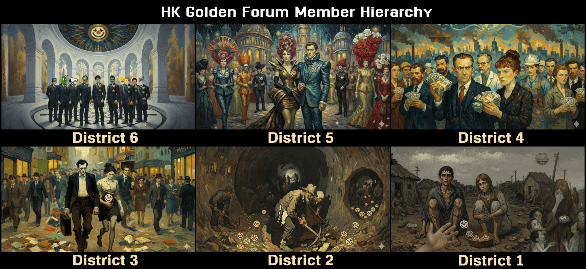

# District Hunger Games - 文字版飢餓遊戲



### Welcome, Welcome！Happy Hunger Games！Tributes, we welcome you！May the odds… be ever in your favor！

---
呢個係一個專為 **討論區 / 論壇 / Discord** 設計嘅 **互動式文字遊戲**，  
完全模仿《飢餓遊戲》嘅核心機制，  
由 **主持人執行 Python 腳本**，玩家PM回覆行動，  
一步步喺 **生死棋盤** 上爭奪生存！

**所有code及遊戲數據都係由ChatGPT生成，藝術圖背景及人物係Gemini生成再用Krita編輯。**

---

## 遊戲特色

| 功能 | 說明 |
|------|------|
| **CSV 自動抽 tribute** | 輸入會員名單 + district，自動每區抽 1 人 |
| **6 大區平衡設計** | 越窮越野外強，越富越易贊助 |
| **4 大技能專精** | 遠攻、近攻、智取、防衛 |
| **視野系統** | District 1 睇 12 格，District 6 只睇 2 格 |
| **體力 = HP** | 移動、攻擊、行動全部扣血，節奏超快 |
| **贊助空投** | 高區容易獲得補給 |
| **戰鬥 + 策略** | 攻擊、隱身、陷阱、結盟、爬樹 |
| **回合制互動** | 主持人跑腳本 → 貼輸出 → 玩家回覆行動 |

---

## 遊戲流程（主持人操作）

```text
1. 準備 members.csv
2. 執行 python game.py
3. 每人揀技能 → 抽武器
4. 回合開始：每人輪流行動
5. 主持人貼狀態 → 玩家回覆行動
6. 最後 1 人存活 → 勝出！
```

---

## 檔案結構

```
district-hunger-games/
│
├── game.py          ← 主遊戲程式
├── members.csv      ← 會員名單（必填）
├── README.md        ← 呢個文件
└── output_log.txt   ← 可選：自動儲存遊戲記錄（進階）
```

---

## `members.csv` 格式

```csv
會員名,district
會員A,1
會員B,5
會員C,1
會員D,6
```

> **注意**：  
> - 每區至少 1 人  
> - `district` 必須係 `1` 到 `6`  
> - 同一人可出現多次（增加被抽機會）

---

## 6 大區平衡數據（核心設計）

| District | 背景 | IQ | 體力 | 野外生存 | 視野範圍 | 贊助率 |
|---------|------|----|------|----------|---------|--------|
| **1** | 極窮，執嘢食 | 50 | 50 | **80** | **12 格** | 10% |
| **2** | 礦工，苦力 | 50 | **70** | **70** | **10 格** | 20% |
| **3** | 中產，白領 | 60 | 60 | 60 | **8 格** | 30% |
| **4** | 工程師，醫生 | **70** | 50 | 40 | **6 格** | 40% |
| **5** | 高級醫生，將領 | **80** | 40 | 30 | **4 格** | **50%** |
| **6** | 政府高官、軍官 | 40 | 30 | 20 | **2 格** | **60%** |

> **數字越細 = 越窮 = 野外生存強 + 視野遠**  
> **數字越大 = 越富 = 贊助多 + 補給快**

---

## 4 大技能專精

| 技能 | 優勢 | 適合武器 | 特殊行動 |
|------|------|---------|---------|
| **遠程攻擊** | 遠距離高傷害 | 弓箭 | 4 格外可攻擊 |
| **近戰肉搏** | 近身爆發 | 刀劍 | 2 格內 +25 傷害 |
| **智取策略** | 陷阱 + 隱身 | 陷阱 | `set_trap` +30 傷害 |
| **堅韌防禦** | 耐打 + 減傷 | 盾牌 | `fortify` 提升 Max HP |

---

## 武器掉落機率（技能影響）

```python
遠攻 → 弓箭機率 ×3
近攻 → 刀劍機率 ×3
智取 → 陷阱機率 ×2
防衛 → 盾牌機率 ×2
```

**所有武器池**：`['bow', 'knife', 'trap', 'shield', 'food', 'medicine', 'random_item']`

---

## 戰場地圖（1D 棋盤）

```
[00][01][02][03] ... [20][21][22][23]
 ← 每 2 格 = 1 單位 →
```

- 移動 1 步 = 移動 2 格 = 扣 **5 HP**
- 攻擊消耗 **10 HP**
- 初始 HP：**100**
- **視野**：根據 district 決定可見範圍

---

## 行動列表

| 行動 | 效果 | 消耗 |
|------|------|------|
| `move` | 移動位置 | 5 HP / 步 |
| `attack` | 攻擊可見敵人 | 10 HP |
| `rest` | 休息回血 | +10~20 HP |
| `ally` | 發出結盟 | 無 |
| `climb_tree` | 爬樹隱身 | 5 HP |
| `set_trap` | 設陷阱（智取） | 8 HP |
| `fortify` | 強化防禦（防衛） | +20 Max HP |

---

## 贊助系統（Sponsor）

- 每回合自動檢查
- 機率 = `sponsor_prob`（見上表）
- 成功 → 回 **15~30 HP** + 隨機物品（食物 / 藥品 / 武器）

---

## 如何開始遊戲

### 1. 下載專案
```bash
git clone https://github.com/Ramen-LadyHKG/HKG_game+District_trails.git
cd HKG_game+District_trails
```

### 2. 準備 `members.csv`
```csv
阿明,1
阿華,2
阿強,3
阿敏,4
阿豪,5
阿傑,6
```

### 3. 執行遊戲
```bash
python game.py
```

### 4. 主持人操作
- 照提示輸入技能選擇
- 每回合貼輸出到討論區
- 玩家回覆行動（如：`move +3`、`attack 阿華`）
- 主持人輸入行動 → 繼續下一回合

---

## 輸出範例（可貼討論區）

```text
=== 第 3 回合 ===

阿明 (D1) | HP: 82/100 | 位置: 8 單位
   可見敵人: [('阿華', 3)]
   可用行動: move, attack, rest, ally, climb_tree
阿明 選擇行動: attack
攻擊誰？: 阿華
   擊中！造成 42 點傷害！
```

---

## 進階功能（可擴充）

- [ ] 自動輸出 `game_log.txt`
- [ ] Discord Bot 版本
- [ ] 圖形化棋盤（ASCII）
- [ ] 結盟系統（共享視野）
- [ ] Cornucopia 開場衝刺
- [ ] 隨機事件（風暴、野獸）

---

## 貢獻指引

1. Fork 專案
2. 開新 branch (`feature/xxx`)
3. Commit 改動
4. Push 並開 Pull Request

---

## License

```
MIT License © 2025
```

---

> **「May the odds be ever in your favor！」**  
> 準備好未？**Cornucopia 號角響起——**  
> **3… 2… 1… GAME ON！**

---

